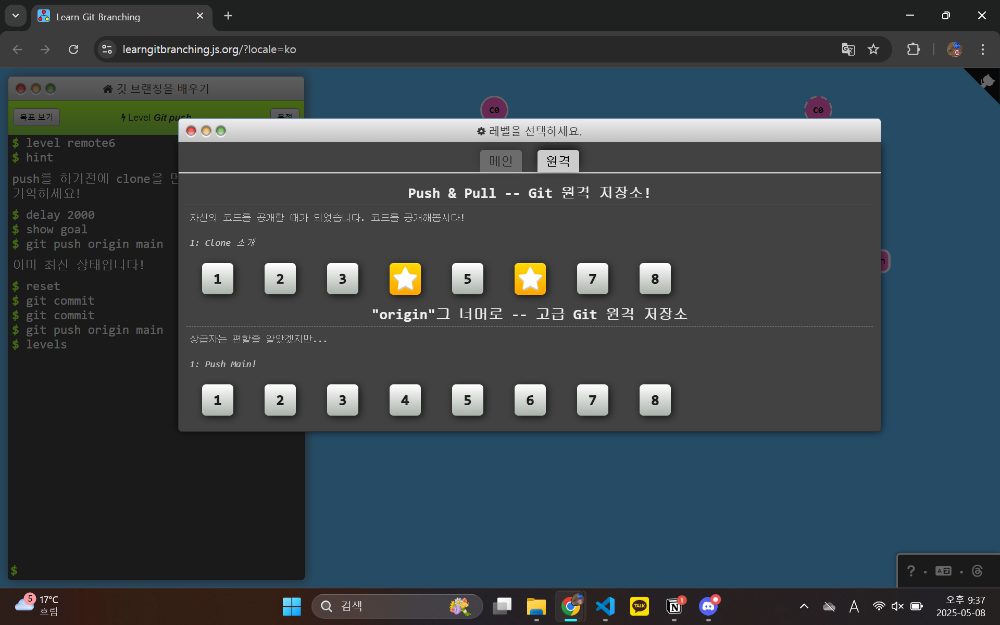
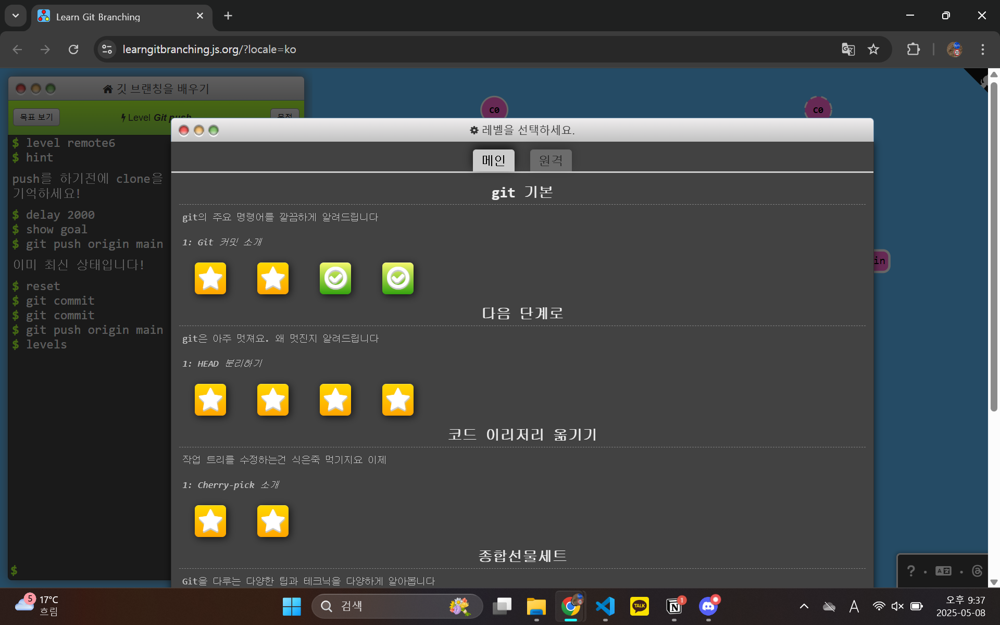

# 1주차 WIL 적는 곳
## GIT에 대해 알아보기
GIT은 VCS이다!
VCS란? 버전 관리 시스템. (Version Control System)
각 파일을 이전의 상태로 되돌리거나 비교, 수정, 삭제, 추적 등이 용이하다

* add - commit - push/pull
git의 구조는
- working directory - staging area - local repository - remote repository로 이루어져 있다.
working directory가 사용자의 로컬컴퓨터에 해당되며, add - commit - push를 통해 remote repo로 파일을 업로드한다.

git add 를 통해 working directory의 파일을 staging area로 파일을 업로드할 수 있다. staging area는 commit을 하기 위해 추가한 파일들이 모여있는 공간

이후 git commit을 통해 staging area에 있던 파일들이 repository로 넘어가고 push를 통해 github와 같은 remote repository로 넘어가게 된다.

- git pull은 remote repo에 있는 파일들을 working directory로 가져오는 과정이며, 이 과정에서 사용자의 컴퓨터에 있는 파일들이 remote repo에 있는 파일들과 자동병합될 수 있다. 자동병합 없이 local repo로 넘기는 명령어는 git fetch

* fork, clone
fork는 다른 사용자의 remote repo를 사용자(나)의 repo로 복사하는 과정. clone은 fork한 repo를 working directory로 옮기는 과정이다.

-> gitgame clear img

# CRUD 서비스 1주차 연습 후기
- 우선은 POST 요청 보내는 것부터 어떻게 보내야할 지 모르겠다. 전에는 인자를 전달받아서 GET요청을 처리하는 것까지는 해봤는데 실제로 데이터를 서버와 로컬에 상호작용을 시키려는 다소 어려운 것 같다.

POSTMAN에 로컬호스트에 POST 명령을 인식시키기는 했는데 POST 하는 데이터가 잘못되어서 400 에러가 표출되었다.

## 2주차 때 보완해야할 것
* JAVA 프로그래밍의 흐름에 더 익숙해지기
* JAVA 내에서 POST 처리하여 데이터 보내기
* JSON을 자유자재로 다룰 수 있도록 연습하기기